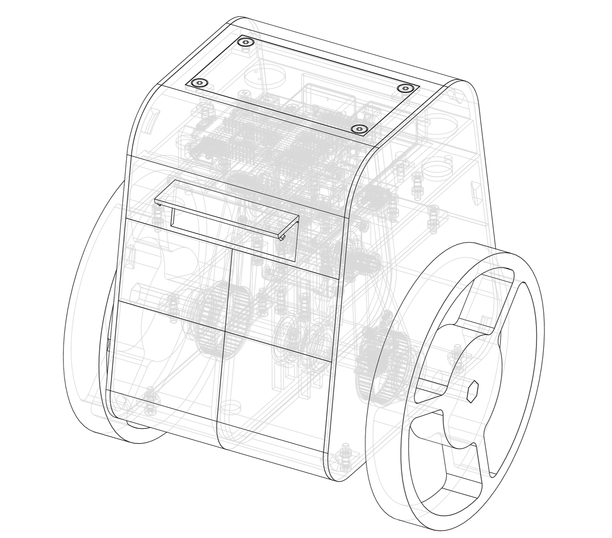

# franklin

A balancing robot

## Background

Franklin is a little balancing robot that I'm working on in my free time. He isn't meant to do anything spectacular; I  thought it would be a good project to help me get a bit better with electronics and low-level programming.

Why the name Franklin? I'm not sure. It was funny to me in the moment, and it kind of stuck.

## How Does He Work?

### Communication

Franklin uses an ESP32 to an access point that I'll connect to with my laptop. The ESP hosts a websocket server that I'll connect to via rust. 

The websockets are fairly minimal; they have a 5-byte header with the following format

`0x46 0x46 <OPERATION> <CONTENT_LEN> 0x00`

`0x46` is an arbitrary number that delineates the beginning of the "packet." Everything is sent via TCP, so these two delineation bytes are a secondary safety measure.

`<OPERATION>` is a single byte, allowing 256 different operations to be sent over the websocket, which is more than enough.

`<CONTENT_LEN>` can be any number of bytes. Each additional byte is summed to the previous, which I know is inefficient for very large packets, but such packets are rare and I figured that the overhead would outweigh the benefit. The ESP server knows to stop summing and switch to reading the payload when it sees the final `0x00` at the end of the header.

## Electronics

Two Nema 17 2A 59Nm steppers drive each of franklin's wheels independently. As of now, these steppers are driven via a DRV8825 controller, which is theoretically capable of 2.2A (with sufficient cooling) before burning up, but 2.0A seems to push its boundaries.

A MPU6050 gyroscope will provide the input to the PID loop, but this is yet to be implemented.

## Final Note
I'm opening this project publicly even though it definitely isn't my best work. I know this project is going to probably turn out a mess, but it's my first time working on something like this. I hope that people see how I performed in this project and contrast it to how I perform in the future.